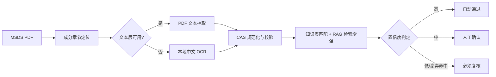

# MSDS 职业危害识别 Agent


**👉 [在线体验 Demo](https://msds-hazard-agent.streamlit.app/)**

面向职业卫生人员的 AI 辅助识别工作流：从 MSDS 的成分章节提取 CAS、含量和页码证据，匹配职业病危害因素知识表，并把不确定项交回人工复核。

> 项目状态：实习后独立重做 / 脱敏重构，历经 Demo→V1→V2 三轮迭代。项目来源：唯享科技 AI 测试实习（负责化学品 MSDS 智能识别工作流的测试与落地）的项目复盘；原始业务资料不随仓库公开。

> 这是辅助决策工具，不替代职业卫生专业判断或法规合规结论。

## 目录

- [业务背景](#业务背景)
- [问题来源与实习场景](#问题来源与实习场景)
- [用户场景](#用户场景)
- [人机方案](#人机方案)
- [工作流](#工作流)
- [架构选型](#架构选型)
- [评测与迭代](#评测与迭代)
- [技术栈](#技术栈)
- [本地运行](#本地运行)
- [项目结构](#项目结构)
- [数据与隐私](#数据与隐私)

## 业务背景

职业卫生人员需要从 MSDS（化学品安全技术说明书）的"成分/组成信息"章节判断物质是否处于职业病危害因素知识表及高毒目录中。原流程依赖人工翻页、复制 CAS 号、查表核对，存在三个痛点：

1. **扫描件无文本层**：部分 MSDS 是扫描 PDF，无法直接复制文本
2. **字体编码异常**：部分 PDF 文字乱码，但 CAS 号可校验
3. **供应商版式差异大**：CAS 与含量粘连、表格格式不统一，容易遗漏或误判

本项目验证的核心问题：**能否把人工翻页查表拆成可审计的步骤，用 CAS 校验保证准确性，同时明确区分"知识表未命中"和"没有危害"？**

## 问题来源与实习场景

这个项目不是凭空想出来的，而是来自一段真实的 AI 测试实习经历：

### 实习中接触到的真实业务

在唯享科技的 AI 测试实习中，我负责化学品 MSDS 职业病危害智能识别工作流的测试与落地，服务的业务方是企业职业卫生/EHS 场景。这个流程的原始形态是纯人工操作，每次有新的化学品入库都需要：

1. 从供应商那里拿到 MSDS（有的是 PDF，有的是扫描件，有的甚至是拍照的图片）
2. 翻到"第3部分：成分/组成信息"，找到每种成分的 CAS 号和含量
3. 把 CAS 号复制到《职业病危害因素分类目录》Excel 表里逐条查找
4. 如果命中高毒物品目录，需要标记并上报
5. 整理成台账，供年度职业病危害因素检测使用

### 这个流程的真实痛点

实习期间处理真实 MSDS 时，发现了几个反复出现的问题：

| 痛点 | 具体经历 |
|------|----------|
| **扫描件无法复制** | 有 12 份 MSDS 是扫描件，只能手动输入 CAS 号，输入 50 个 CAS 号花了 3 小时，还输错了 2 个 |
| **字体编码乱码** | 有一家供应商的 PDF 文字层是乱码，但 CAS 号恰好是数字和连字符，可以正常显示——这种"半乱码"文件最坑人，你以为能复制，其实复制出来的是乱码 |
| **CAS 与含量粘连** | 有的供应商把 CAS 号和含量写在同一格里，比如"71-43-2 99.5%"，手动拆分时容易把含量的数字也当成 CAS 号的一部分 |
| **"未命中"不等于"无危害"** | 有一次我把一份 MSDS 标记为"无危害"，因为 CAS 号在知识表里没找到。但业务方明确指出："知识表不是全集，没找到可能是知识表没收录，不代表这个物质没有危害。"这条规则成了这个项目最核心的产品规则 |
| **高毒物质必须人工复核** | 有一次（人工查表）命中了一个高毒物质，业务方没有直接上报，而是重新核对了 CAS 号、翻了原始 MSDS、甚至查了国标——高毒物质关系到员工健康和合规，必须人工确认，不能出错 |

### 为什么不用现成工具

| 方案 | 为什么不够 |
|------|-----------|
| 通用 OCR 工具（如微信扫一扫、百度 OCR） | 只能提取文字，不会自动匹配知识表，也不会区分"未命中"和"无危害" |
| 大模型直接读取 PDF 判断 | 容易幻觉（编造 CAS 号和危害分类），高风险场景不可解释、不可审计 |
| 人工查表 | 准确但效率极低，50 份 MSDS 需要 2 天，且容易因为疲劳出错 |

**结论**：这个场景的核心不是"识别 MSDS"，而是"在识别不可靠的前提下，设计一个能校验、能审计、能兜底、有人复核的工作流"。CAS 校验位算法是这个项目的关键设计——它让我们可以在不依赖大模型的情况下，验证 CAS 号是否正确，这比任何 OCR 模型都更可靠。

## 用户场景

- **目标用户**：企业职业卫生人员、EHS 工程师
- **核心场景**：批量处理 MSDS PDF，系统自动提取成分章节的 CAS 号、含量、页码，匹配知识表和高毒目录，输出带证据的识别结果和处理建议
- **边界**：不替代职业卫生专业判断，不输出"无危害"结论，不做法规合规判定

## 人机方案

| 环节 | AI/系统负责 | 人负责 |
|------|------------|--------|
| 成分章节定位 | 自动定位"第3部分/成分"章节 | 定位失败时人工指定 |
| CAS 提取 | PDF文本抽取 + 本地OCR降级，CAS校验位验证 | OCR失败时人工录入 |
| 知识表匹配 | CAS优先匹配 + RAG语义检索增强，输出目录名称和高毒标记 | 知识表未命中时人工确认 |
| 风险判定 | 自动通过/人工确认/必须复核三级分流 | 高毒目录命中必须人工复核 |

关键产品规则：
- **CAS 未命中 = "当前知识表未命中"，不等于无危害**
- 高毒目录命中 = 必须人工复核
- 扫描件、OCR 字段缺失、字体编码异常 = 降置信度，字段留空并转人工
- 输出保留原始 CAS、规范 CAS、页码与处理动作

## 工作流



## 架构选型

采用 **固定 Workflow + CAS 校验位算法 + RAG 检索增强 + 确定性匹配 + Human in the Loop**，在 CAS 精确匹配基础上引入 RAG 语义检索提升成分名称与危害分类的召回率，同时高风险场景保留人工复核兜底，不让大模型自主输出最终危害结论。

1. **安全关键场景要求可复现、可审计**：同一份 MSDS 每次运行必须得到相同结论，大模型的温度采样和幻觉风险在职业健康场景不可接受
2. **CAS 校验位是比大模型更可靠的验证手段**：CAS 号自带模 10 校验位，能在不调用任何模型的情况下验证提取是否正确，这是确定性规则的优势
3. **RAG 检索增强召回**：对于 CAS 匹配未命中但成分名称相近的物质，通过 RAG 语义检索知识表补充候选，降低漏检率；检索结果仅作为候选，最终判定仍以 CAS 校验和人工确认为准
4. **"未命中 ≠ 无危害"是产品规则，不是模型能力**：这个区分必须由系统逻辑保证，不能依赖大模型"自觉"不编造
5. **高毒目录命中必须人工复核**：涉及员工健康和法规合规，任何自主决策都有伦理和法律风险

> 大模型在本项目中用于 OCR 降级时的辅助识别和 RAG 检索的语义编码，不直接参与最终风险判定。这是刻意的产品选择——高风险结论必须有确定性规则和人工复核双重保障。

## 评测与迭代

### 版本演进

| 版本 | 方法 | 真实黄金集 | 说明 |
|------|------|-----------|------|
| Demo | Streamlit 上传式演示 | — | 验证核心流程，不保存上传文件 |
| V1 | PDF 文本抽取 + CAS 校验 + 置信度分级（高置信自动/中置信人工确认/高毒强制复核） | 8/12 | 扫描件和编码异常无法处理 |
| V2 | V1 + 本地中文 OCR + RAG 检索增强 + 页图证据 | 11/12 | 解决扫描件和编码异常，高毒命中率 100% |

V2 在 V1 基础上新增本地 OCR 与 RAG 检索增强，不改变评测集与判定规则。

### V1 失败案例

| 类型 | V1 行为 | V2 处理 |
|------|---------|---------|
| 扫描件无文本层 | 输出"无法抽取"并转人工 | 接入本地 OCR，保留页图证据 |
| 字体编码异常 | CAS 匹配可用但名称乱码，全部人工确认 | OCR 复原名称与版面，RAG 补充语义匹配 |
| CAS 与含量粘连 | 误切分风险 | CAS 校验位+候选聚类，表格坐标抽取，不做无校验猜测 |

### V2 遗留问题

V2 剩余 1 个失败样本：扫描件中 `Sn`（锡）被 OCR 误识别为 `Sm`（钐），锡未自动入表、转人工处理。Sn 与 Sm 在扫描件中字形相近，属于 Tesseract 的识别局限。后续方向：换用更强的 OCR 引擎，或对金属元素 CAS 增加人工复核环节。

### 评测边界

- 评测样本来自 12 份真实 MSDS 的人工标注，结果仅代表该样本集
- 原始 MSDS、OCR 页图与逐字段结果未随仓库公开（可能包含供应商、联系人或受限业务资料）
- 公开版包含代码、规则、聚合指标与遗留问题结论

## 技术栈

- **PDF 文本抽取**：PyMuPDF + pypdf
- **OCR**：Tesseract（含 chi_sim 中文语言包）
- **CAS 校验**：CAS 号校验位算法（模10验证）
- **知识表匹配**：pandas 读取 Excel 知识表，CAS 精确匹配 + RAG 语义检索增强
- **Demo 界面**：Streamlit（`demo/` 目录）

## 本地运行

### V2 完整版本（含 OCR 与 RAG）

安装 Python 依赖并安装本地 Tesseract（含 `chi_sim` 中文语言包）后：

```powershell
python -X utf8 app/run_local_ocr_v2.py `
  --source "<MSDS PDF 所在目录>" `
  --knowledge "<化学物质名称对应表.xlsx>" `
  --tessdata "<包含 chi_sim.traineddata 与 eng.traineddata 的目录>" `
  --tesseract "C:\Program Files\Tesseract-OCR\tesseract.exe" `
  --scan-page 1 --hardener-page 3 --paint-page 3 `
  --output "eval/results_v2.csv"
```

### Demo 版本（Streamlit 上传界面）

```bash
cd demo
pip install -r requirements.txt
streamlit run app.py
```

Demo 处理带可读文本层的 MSDS PDF；扫描件和乱码文件会提示转入本地 OCR / 人工确认流程。不保存上传文件。V2 批处理的页码和 Tesseract 路径均可通过参数调整。

## 项目结构

```
├── README.md
├── requirements.txt
├── app/
│   └── run_local_ocr_v2.py        # V2 本地 OCR + RAG 批处理
├── demo/                           # 早期 Streamlit 上传式 Demo
│   ├── app.py
│   ├── README.md
│   └── requirements.txt
├── docs/
│   ├── product-brief.md           # 产品简述
│   ├── badcase_v2.md              # V2 Bad Case 报告
│   └── privacy.md                 # 隐私说明
└── eval/                           # 评测结果（聚合指标）
```

## 数据与隐私

- 原始 MSDS、OCR 页图与逐字段结果不随仓库公开
- 公开版包含代码、规则、聚合指标与遗留问题结论
- 系统不保存上传文件（Demo 版）
- 不输出"无危害"结论，所有不确定项转人工

## License

MIT
